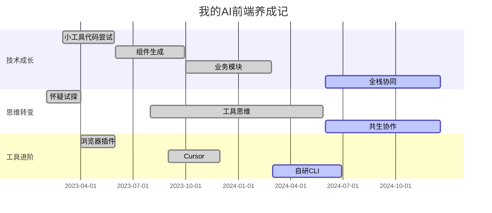
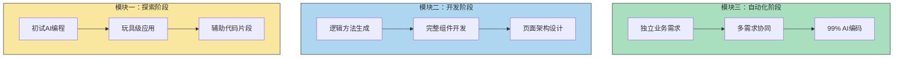
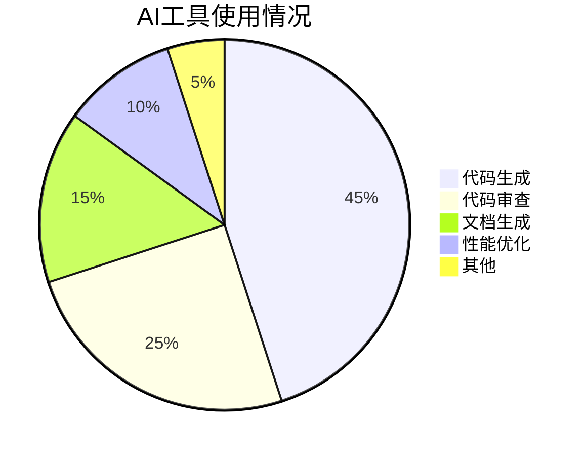
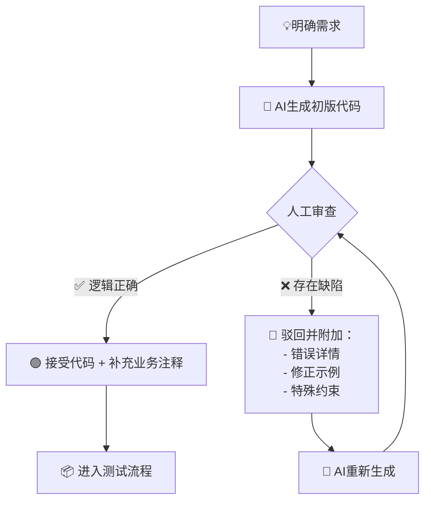
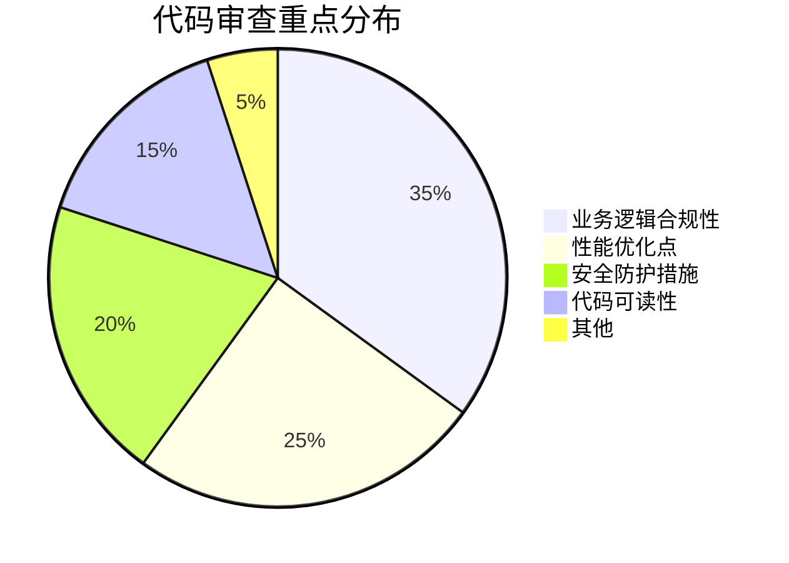

# 两年沉淀：AI驱动前端开发的渐进式变革



---

## 🌈 一、AI编程能力进化路线图（流程图）




**关键案例**：
1. 早期案例：使用AI生成表单验证正则表达式（耗时从30min→2min）
2. 进阶案例：通过自然语言描述实现Echarts可视化组件（耗时从1h→10min）
3. 里程碑案例：AI协助完成业务小程序代码开发（99%代码由AI生成）

---

## 🧠 二、开发者思维范式转移（对比图表）

| 传统模式          | AI协作模式          | 效率提升点         |
|-------------------|---------------------|--------------------|
| 自主编码(100%)     | 代码审核(20%)       | 时间成本↓80%       |
| 调试耗时40%        | 逻辑验证30%         | 错误率↓65%         |
| 技术调研30%        | 方案对比15%         | 决策速度↑200%      |
| 文档编写20%        | 注释生成+校验10%    | 可维护性↑50%       |

**思维转变三阶段**：
1. **怀疑期**："AI写的代码能用吗？"
  - "这代码能用？连Optional Chaining都不知道？"
  - "重写80%的实现逻辑"
2. **磨合期**："我需要更清晰的prompt"
  - "帮我写一个XXX组件"
  - "帮我实现一个XXX功能"
  - "帮我优化一下这段代码"
3. **共生期**："AI是我的高级工程师"
  - Cursor：上下文感知的智能IDE
  - 工具库实现
  - 自研CLI工具

---

## 📊 三、使用场景图谱


**核心工具评测**：
1. Cursor：智能补全+跨文件理解+YOLO模式
2. Windsurf：全自动流程代码审查+终端命令
3. bolt.new：项目初始化+实现个人站点

---

## 🔍 四、提示词工程体系（金字塔模型）
```
         ┌───────────────┐
         │ 业务目标层    │ <-- 产品需求文档核心要点
         └──────┬────────┘
         ┌──────┴────────┐
         │ 技术架构层    │ <-- 框架/版本/依赖约束
         └──────┬────────┘
         ┌──────┴────────┐
         │ 实现规范层    │ <-- ESLint规则/团队规范
         └──────┬────────┘
         ┌──────┴────────┐
         │ 异常处理层    │ <-- 错误边界/降级方案
         └───────────────┘
```

**实战技巧**：
1. 三明治提问法：
   "我需要实现__功能__
   当前技术栈是__框架+版本__
   需要特别注意__业务约束__"

2. 渐进式修正：
   "当前方案存在__问题__
   请提供三种改进方案
   分别考虑__不同维度__"

3. 培养AI语感：
❌ "写个登录页面" → 得到幼儿园级代码
✅ "实现Antd5表单登录，包含：
- 中国大陆手机号校验
- 防重复提交机制
- 错误提示i18n支持"

--- 

## 🔄 五、当前协作模式



---

### 📌 **协作模式深度解析**  

#### 阶段一：需求拆解（人为主导）  
**检查清单**：  
- [ ] 业务目标是否明确？（如转化率提升3%）  
- [ ] 技术约束是否完整？（兼容移动端）  
- [ ] 异常场景是否覆盖？（网络中断处理）  

**避坑经验**：  
▸ 给AI看产品原型图比文字描述效率高2倍  

#### 阶段二：代码生成（AI主输出）  

**效能对比**：  
| 任务类型       | 传统耗时 | AI协作耗时 |  
|----------------|----------|------------|  
| 基础组件开发   | 4h       | 1.5h       |  
| 复杂业务模块   | 16h      | 6h         |  
| 紧急需求修复   | 3h       | 45min      |  

#### 阶段三：人工审查（关键防线）  
**必检项雷达图**：  


**高频驳回场景**：  
1. 过度设计：AI生成复杂的观察者模式，而实际只需事件总线  
2. 水土不服：使用未被公司批准的第三方库  
3. 安全漏洞：在本地存储敏感信息  

#### 阶段四：迭代优化（双向提升）  
**我的修正模板**：  
```markdown
[修正要求]  
问题定位：组件渲染导致内存泄漏  
期望方案：  
1. 使用useMemo缓存计算结果  
2. 增加组件卸载时的清理逻辑  
3. 添加内存监控埋点  

[参考示例]  
// 正确的清理方式  
useEffect(() => {  
  const listener = () => {...};  
  return () => window.removeEventListener(listener);  
}, []);
```

---


## 📝 六、经验沉淀与反思
1. **效率曲线**：前6个月投入回报比低，后期呈现指数级增长
2. **质量控制**：AI代码的单元测试覆盖率需保持100%
3. **知识保留**：建立AI解决方案知识库（已积累300+可复用案例）
4. **边界认知**：不适合AI的场景（核心算法/高安全需求）

---

## 🔮 七、未来演进方向
1. 自定义AI模型微调（基于团队代码库）
2. 全链路自动化流水线
3. 智能需求分析系统
4. 自修复代码机制

---

## 🚀 八、总结

从『这行代码必须我亲手写』到『这个需求交给我的AI搭档』，最大的改变不是coding时间减少，而是终于能站在产品视角思考——因为AI帮我扛住了技术实现的重负。如果你也在前端路上，不妨试试与AI共舞，或许会打开新世界的大门🚪

_"现在的协作就像培养顶级实习生：
我负责制定目标和验收标准，AI负责高效执行
当它犯错时，不是简单驳回，而是给出明确改进路径
这套流程跑顺后，终于实现了：
▸ 需求响应速度提升3倍
▸ 代码规范性提高40%
▸ 有时间深耕架构设计领域

