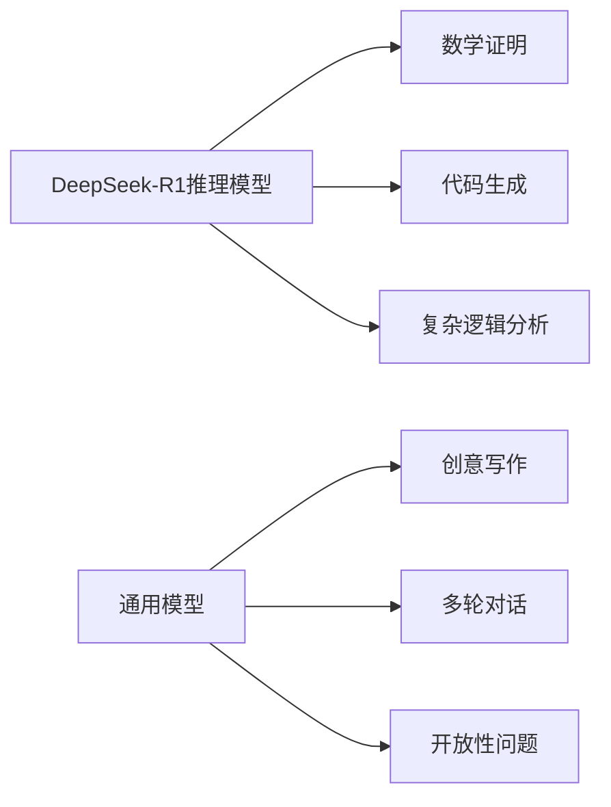
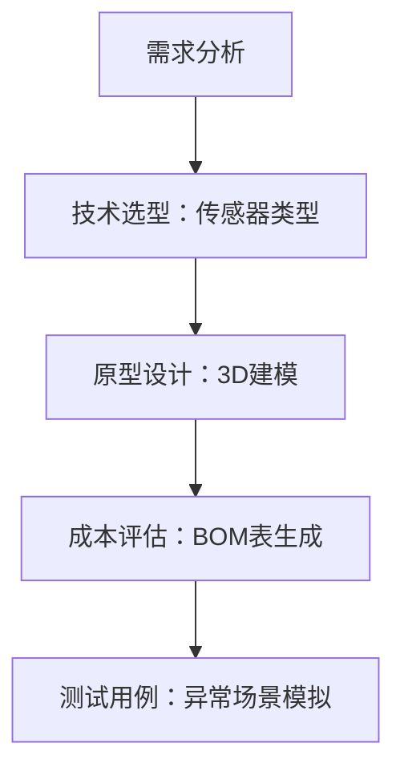
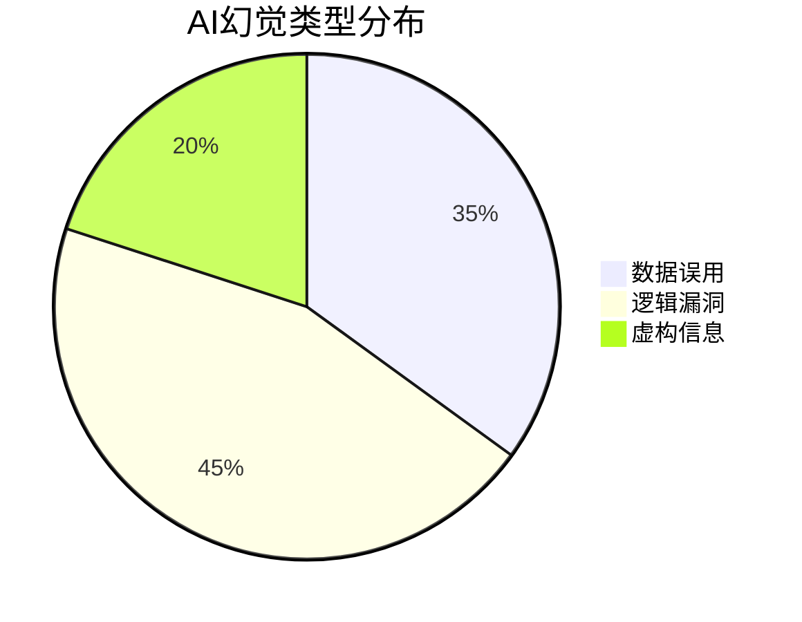

# 《DeepSeek从入门到精通》深度解析：一本AI时代的实战手册

---

## 一、DeepSeek核心架构解析  
### 1.1 技术定位与模型对比  
DeepSeek作为**国产开源AGI平台**，其技术架构融合推理模型与通用模型优势，适用于不同场景需求：  


**性能对比表**：  
| 维度            | 推理模型              | 通用模型              |  
|-----------------|----------------------|----------------------|  
| 响应速度        | 慢速链式推理（CoT）   | 快速概率预测          |  
| 适用场景        | 数学推导/代码优化     | 营销文案/故事创作     |  
| 输出稳定性      | 高（结构化输出）      | 中（依赖提示语设计）  |  

### 1.2 功能全景图与技术栈  
DeepSeek覆盖**八大核心模块**，形成完整技术生态：   
- **文本生成**：从营销文案到学术摘要，支持多语言翻译与结构化输出（如表格、代码注释）。  
- **自然语言理解**：语义分析、情感识别、实体提取，适用于舆情监控与客服自动化。  
- **编程辅助**：代码生成、调试建议、文档撰写，提升开发者效率。  
- **数据分析**：资源优化、建模分析、决策支持，助力企业智能化升级。  
- **可视化工具**：支持流程图、时序图、数据图表生成，简化复杂信息呈现。  
- **跨域知识整合**：通过概念嫁接、知识迁移等策略，实现跨学科创新。  
- **伦理与安全**：内置隐私保护、偏见检测机制，确保AI应用合规性。  
- **多模态交互**：整合文本、图像、数据，生成综合性分析报告。  

---

## 二、提示语工程：从入门到高阶  
### 2.1 基础设计框架（TASTE模型）  
```  
任务（Task）：生成气候变化分析报告  
受众（Audience）：政府决策者  
结构（Structure）：问题背景→数据支撑→解决方案  
语气（Tone）：严谨专业  
示例（Example）：参考IPCC报告风格  
```  

### 2.2 高阶技巧：SPECTRA任务分解  
**案例：开发智能家居安全系统**  


**提示语优化对比**：  
| 低效提示                          | 高效提示                                  |  
|-----------------------------------|-----------------------------------------|  
| "写个智能家居方案"                | "设计基于毫米波雷达的跌倒检测系统，输出硬件选型清单与算法流程图，预算<500元" |  
| "分析销售数据"                    | "使用ARIMA模型预测Q3销售额，要求包含置信区间与季节性因素分析"          |  

---

## 三、实战场景：企业级应用指南  
### 3.1 技术写作自动化  
**结构化内容生成流程**：  
1. **输入**：原始论文PDF  
2. **处理**：DeepSeek-R1提取核心论点  
3. **输出**：生成三种格式：  
   - 学术摘要（500字）  
   - 科普文章（1500字）  
   - 演讲PPT大纲（10页）  

**效率对比**：  
| 任务类型       | 人工耗时 | DeepSeek耗时 |  
|----------------|----------|--------------|  
| 技术文档撰写    | 8小时    | 1.5小时      |  
| 数据分析报告    | 6小时    | 45分钟       |  

### 3.2 代码生成与优化  
**Python快速排序案例**：  
```python  
# DeepSeek生成代码（带优化建议）  
def quick_sort(arr):  
    if len(arr) <= 1:  
        return arr  
    pivot = arr[len(arr)//2]  
    left = [x for x in arr if x < pivot]  
    middle = [x for x in arr if x == pivot]  
    right = [x for x in arr if x > pivot]  
    return quick_sort(left) + middle + quick_sort(right)  

# AI优化建议：  
1. 添加类型注解提升可读性  
2. 改用in-place排序减少内存占用  
3. 增加单元测试用例  
```  

---

## 四、避坑指南：常见问题与解决方案  
### 4.1 AI幻觉识别与应对  
**三类典型幻觉场景**：  


**应对策略**：  
1. **事实核查指令**：  
   ```  
   生成内容后自动标注数据来源，如“根据2023年统计局数据：...”  
   ```  
2. **交叉验证**：要求AI从正反两面论证同一命题。  

### 4.2 伦理风险防控  
**企业审查清单**：  
| 风险维度       | 检查项示例                  | 工具支持                |  
|----------------|---------------------------|-----------------------|  
| 数据隐私       | 是否包含用户个人信息？      | 敏感词过滤模块         |  
| 算法偏见       | 性别/地域分布是否均衡？     | 公平性评估仪表盘       |  
| 法律合规       | 是否符合《生成式AI管理办法》？ | 合规性自检模板         |  

---

## 五、从理论到实践：30分钟快速入门  
### 5.1 新手任务：自动生成周报  
**步骤分解**：  
1. **输入原始数据**：  
   ```  
   本周完成：用户登录模块开发（8h）、需求评审3场（6h）  
   下周计划：接口联调（12h）、压力测试（8h）  
   ```  
2. **提示语设计**：  
   ```  
   将以上信息整理为周报，包含：  
   - 重点成果（带进度条可视化）  
   - 问题与解决方案（表格呈现）  
   - 使用50字以内的技术术语总结  
   ```  
3. **输出结果**：自动生成Markdown格式周报，含可视化图表。  

### 5.2 进阶挑战：构建数据分析管道  
**技术栈整合方案**：  
```  
1. DeepSeek提取数据库原始数据 →   
2. 生成Pandas清洗代码 →   
3. 创建Power BI可视化模板 →   
4. 输出分析结论与预警建议  
```  

---

## 六、资源附录：效率提升工具箱  
### 6.1 精选提示语模板库  
| 场景         | 模板示例                                                                 |  
|--------------|--------------------------------------------------------------------------|  
| 代码生成     | "用Python实现__功能__，要求：①时间复杂度O(__) ②包含异常处理 ③添加类型注解" |  
| 商业分析     | "基于__数据集__，分析__指标__的__趋势__，输出：SWOT分析+雷达图+3条策略建议" |  
| 学术写作     | "以__理论__解释__现象__，需包含：①3个经典案例 ②方法论局限性 ③未来研究方向"  |  

### 6.2 官方资源导航  
- **学习路径**：新手教程→案例库→API文档→伦理规范  
- **社区支持**：GitHub问题跟踪、技术论坛、月度直播答疑  
- **企业服务**：私有化部署方案、定制模型微调、合规咨询  

--- 